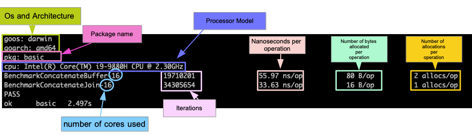

# Some reminders

## Concurrency package
- Get used to reading benchmarks
- Do not forget the syntax learnt in the concurrency package: channels, send statement, receive expression, goroutines created and executed at once with "go func() {...}()"
- Go has a race detector, "go test -race" 

