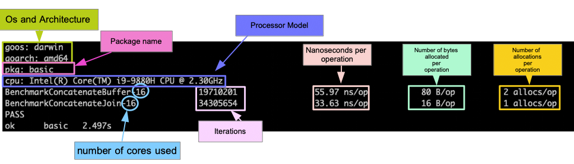

# Some reminders

## Concurrency package
- Get used to reading benchmarks
- Do not forget the syntax learnt in the concurrency package: channels, send statement, receive expression, goroutines created and executed at once with "go func() {...}()"
- Go has a race detector, "go test -race" 

## Select package
- As I have in many other packages, there are "anonymous functions". Example: "methodFoo(func (anything string) {print(anything)})"
- By prefixing a function call with `defer` it will now call that function at the end of the containing function.
- `select` helps us synchronise processes. Its syntax is similar to `switch`. It allows you to wait on multiple channels. The first one to send a value "wins" and the code underneath the case is executed. Sometimes you'll want to include `time.After` in one of your cases to prevent your system blocking forever.